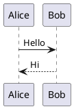

# Personal Site

A personal site and lightweight CMS built with Next.js 16, React 19, Supabase, and Tailwind CSS 4.

It includes a public-facing site for posts, thoughts, and events, plus a locale-aware dashboard for content, tags, images, config, and account management.

## Features

- Public pages for posts, thoughts, and events
- Dashboard for managing posts, thoughts, events, tags, images, site config, and account info
- Supabase-backed auth, database, and storage
- Locale-aware routing with `en-US` and `zh-CN`
- Markdown rendering with GFM, syntax highlighting, heading anchors, and custom directives
- PlantUML code block rendering through the public PlantUML server
- Click-to-open image preview
- Cache revalidation webhook for content updates

## Tech Stack

- [Next.js 16](https://nextjs.org/) with App Router
- [React 19](https://react.dev/)
- [Tailwind CSS 4](https://tailwindcss.com/)
- [Supabase](https://supabase.com/)
- [react-markdown](https://github.com/remarkjs/react-markdown)
- [remark-gfm](https://github.com/remarkjs/remark-gfm)
- [remark-directive](https://github.com/remarkjs/remark-directive)
- [rehype-prism-plus](https://github.com/timlrx/rehype-prism-plus)
- [Framer Motion](https://www.framer.com/motion/)
- [Lucide React](https://lucide.dev/)
- [Bun](https://bun.sh/) for local scripts and package management

## Prerequisites

- Node.js 18+
- Bun
- A Supabase project

## Getting Started

### 1. Clone the repository

```bash
git clone https://github.com/muyu258/personal-site.git
cd personal-site
```

### 2. Install dependencies

```bash
bun install
```

### 3. Configure environment variables

```bash
cp .env.example .env.development
```

Required values:

- `NEXT_PUBLIC_SUPABASE_URL`
- `NEXT_PUBLIC_SUPABASE_ANON_KEY`
- `SUPABASE_SERVICE_ROLE_KEY`
- `DATABASE_URL`
- `SITE_URL`
- `WEBHOOK_SECRET`

Optional values:

- `NEXT_PUBLIC_APP_TIMEZONE`

The example file also works as a reference for production env setup.

### 4. Set up Supabase

1. Create a Supabase project.
2. Run the SQL in order: `supabase/schema.sql`, `supabase/rpc.sql`, `supabase/data.sql`, and `supabase/rls.sql`.
   Optional test data lives in `supabase/data.test.sql`.
3. Create a public storage bucket named `images`.
4. Fill in the env values from your project settings.

### 5. Start the development server

```bash
bun run dev
```

Open [http://localhost:3000](http://localhost:3000).

### 6. Access the dashboard

Open [http://localhost:3000/en-US/auth](http://localhost:3000/en-US/auth) or [http://localhost:3000/zh-CN/auth](http://localhost:3000/zh-CN/auth).

The auth page supports email/password sign-in and sign-up, and the dashboard `Config` page controls which OAuth providers are available.

The home page intro markdown and playlist URL are configured in the dashboard `Config` page, not through environment variables.

If you need admin access for an existing user, use the interactive maintenance menu:

```bash
bun run menu dev
```

Then choose `Promote user to admin`.

## Markdown Support

Content is rendered with `react-markdown`, `remark-gfm`, and custom directive handling.

### PlantUML

Use a fenced code block with `plantuml` or `puml`:

````md

````

The client compresses and encodes the source, then requests SVG output from the public PlantUML server:

```txt
https://www.plantuml.com/plantuml/svg/{encoded}
```

Because diagrams are sent to a public service, avoid putting sensitive content in PlantUML blocks.

### Custom directives

The renderer also supports custom directives such as:

- `:ref[...]` for linking to posts, thoughts, events, files, or external URLs
- `::card{title="..." tone="info"}` for callout-style content blocks
- `:meta{url="https://..."}` for URL metadata cards

## Scripts

- `bun run dev` - start the Next.js dev server
- `bun run build` - build for production
- `bun run start` - start the production server
- `bun run lint` - run Biome checks and `tsc --noEmit`
- `bun run format` - apply Biome fixes
- `bun run menu dev` - open the interactive maintenance menu with `.env.development`
- `bun run menu prod` - open the interactive maintenance menu with `.env.production`
- `bun run gen:types:dev` - generate Supabase types using `.env.development`
- `bun run gen:types:prod` - generate Supabase types using `.env.production`
- `bun run gen:icons` - regenerate icon components from `public/svg-icons`

The interactive menu currently includes:

- Reset database (optional test data)
- Rebind webhooks
- Promote user to admin

## Project Structure

```txt
.
├── scripts/                 # Interactive maintenance utilities
├── src/
│   ├── app/                 # App Router pages and API routes
│   ├── components/          # Shared UI and feature components
│   ├── lib/                 # Client/server/shared helpers
│   ├── styles/              # Global styles
│   └── types/               # Shared TypeScript types
├── supabase/
│   ├── schema.sql           # Tables and schema setup
│   ├── rpc.sql              # Query and helper functions
│   ├── data.sql             # Initial data
│   ├── data.test.sql        # Extra test data
│   ├── rls.sql              # Grants and row-level security
└── public/                  # Static assets
```

## Deployment Notes

For deployment, provide the same environment variables as local development, especially:

- `NEXT_PUBLIC_SUPABASE_URL`
- `NEXT_PUBLIC_SUPABASE_ANON_KEY`
- `SUPABASE_SERVICE_ROLE_KEY`
- `DATABASE_URL`
- `SITE_URL`
- `WEBHOOK_SECRET`

If OAuth is enabled, make sure your Supabase auth redirect URLs include your deployed site URL and the callback route.

## License

[MIT](LICENSE)
